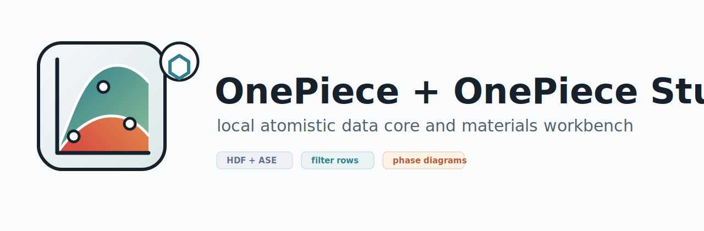
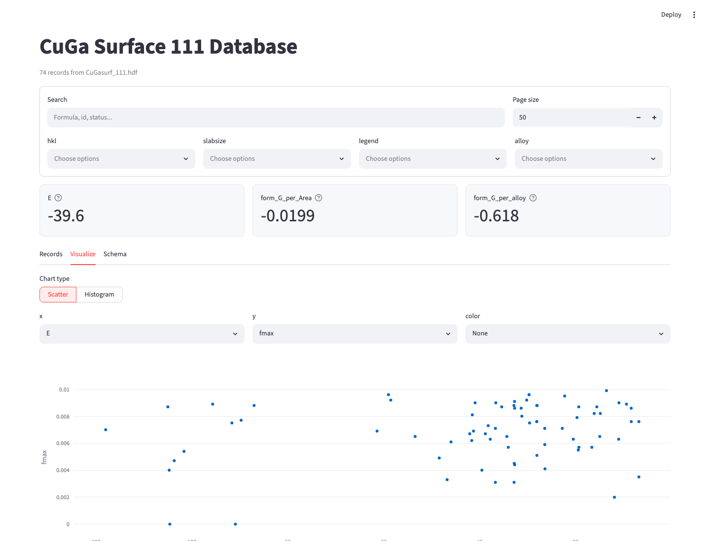
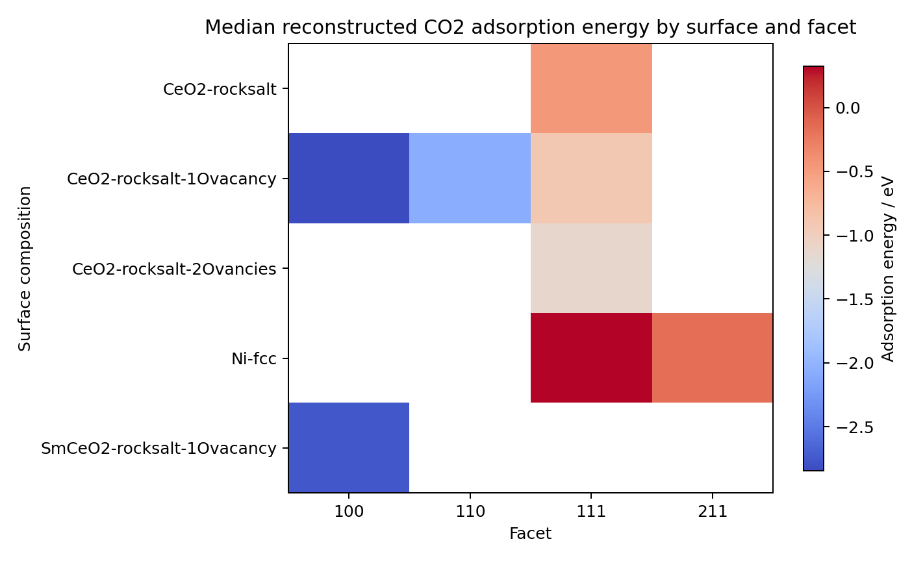
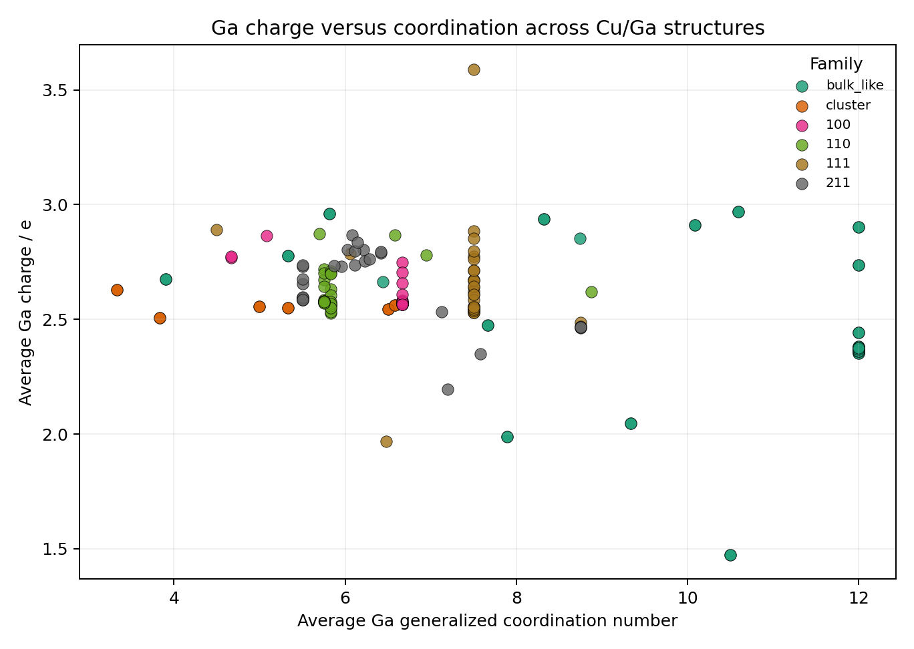
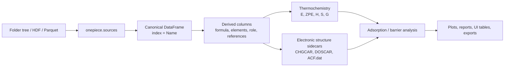
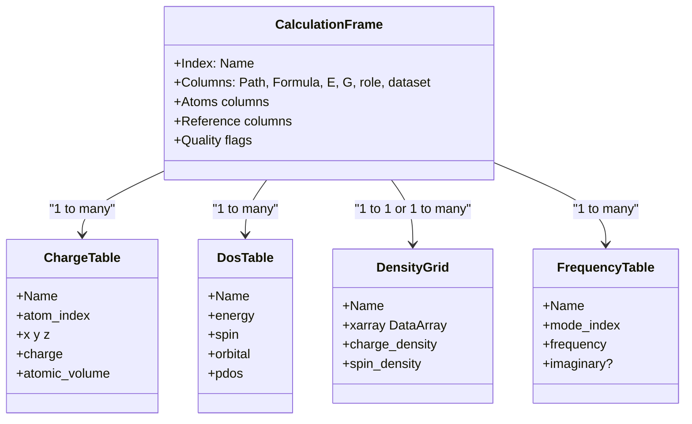
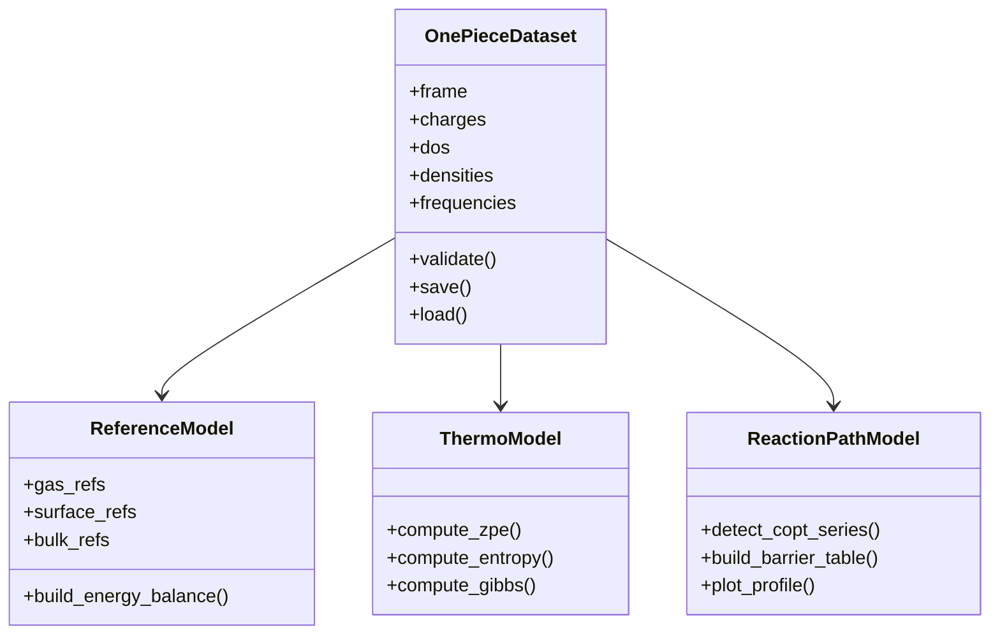
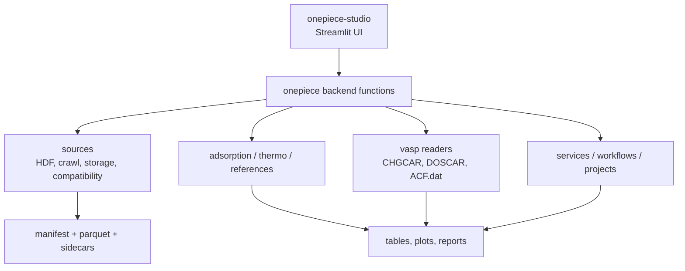

# OnePiece



`OnePiece` is a scientific data backend for atomistic simulation datasets. It is built for
ASE-centered workflows in catalysis, surface science, and computational materials chemistry.
The companion UI, `onepiece-studio`, adds a local browser workbench for inspection, filtering,
plotting, adsorption analysis, Gibbs-energy analysis, and dataset QA.

This repository contains both distributions:

- `onepiece`: backend package
- `onepiece-studio`: Streamlit frontend package in [`ui/pyproject.toml`](ui/pyproject.toml)

## What it does

OnePiece is designed for datasets that contain structures plus calculation metadata, especially:

- adsorption energies and adsorption free energies
- gas, surface, bulk, and adsorbate reference assignment
- copt / constrained-reaction-path processing
- vibrational frequencies and thermochemistry
- Bader charges from `ACF.dat`
- CHGCAR charge-density parsing
- DOSCAR / projected DOS parsing
- HDF compatibility plus newer manifest + parquet storage
- UI-driven workflows where the frontend issues commands and the backend performs DataFrame operations

## Why this package exists

In many DFT projects, data analysis lives in ad hoc notebooks and folder-specific scripts. That is
fine for one week and painful for one thesis. OnePiece tries to move the recurring scientific logic
into a reusable backend:

- read many calculations into one consistent table
- derive physically useful columns early
- keep the row identity stable through analysis
- compute energies, references, and thermodynamic corrections in a repeatable way
- let the UI stay thin and use the backend as the real execution layer

## Screenshots and examples

### OnePiece Studio



### Catalysis-Hub style reaction-energy overview



### Cu/Ga dataset example



## Installation

### Backend only

Use this for notebooks, scripts, or automated analysis:

```bash
pip install onepiece
```

With the optional faster tabular engine:

```bash
pip install "onepiece[performance]"
```

### UI workbench

The frontend package lives in this repository under [`ui/`](ui/).
After publishing, install it with:

```bash
pip install onepiece-studio
```

For local development from this repository:

```bash
pip install -e .[dev,docs]
pip install -e ./ui
```

## Quick start

### 1. Just launch it

```bash
onepiece-studio
```

This opens a welcome page where you can explore the bundled tutorial
dataset, open one of your own HDF/parquet datasets, or reopen a recent
file. `onepiece-studio tutorial` jumps straight into the tutorial dataset.

### 2. Open an existing HDF database

```bash
onepiece-studio hdf "/path/to/database.hdf" --key df --title "Local Database"
```

### 3. Check whether an environment is complete

```bash
onepiece-studio doctor
```

### 4. Run the bundled QA smoke test

```bash
onepiece-studio qa
```

Audit a managed dataset for FAIR provenance before sharing it:

```bash
onepiece-studio fair-audit ".onepiece/workspace/mnvo_oer_surface_screening" \
  --require-reference-scheme \
  --require-publication-metadata
```

Export interoperable RO-Crate-style JSON-LD metadata:

```bash
onepiece-studio ro-crate ".onepiece/workspace/mnvo_oer_surface_screening" \
  --output ro-crate-metadata.json
```

## New student path

For a new student in a research group, the recommended first sequence is:

```bash
onepiece-studio doctor
onepiece-studio qa
onepiece-studio tutorial
```

Then continue with the docs pages:

- [First Day Guide For A Bachelor Student](docs/source/first_day_student.md)
- [Load Your First Lab Dataset](docs/source/load_first_lab_dataset.md)

## Backend example

```python
from pathlib import Path

import pandas as pd

from onepiece import add_adsorption_energies, assign_surface_references, crawl_root_to_hdf

output = crawl_root_to_hdf(
    root=Path("calculations"),
    output_hdf=Path("created_frame.hdf"),
    calc_file="final.traj",
    include_chgcar=True,
    include_doscar=True,
    include_bader=True,
    include_frequencies=True,
)

frame = pd.read_hdf(output, key="df")
frame = assign_surface_references(frame)
frame = add_adsorption_energies(frame)
```

## Scientific model

OnePiece is aimed at practical thermochemistry for catalyst datasets. The package distinguishes
between electronic energies and thermodynamic corrections, then carries both through the same
tabular workflow.

### Gibbs-energy logic

For a gas-phase species:

```math
G_{\mathrm{gas}}(T) = E_{\mathrm{DFT}} + E_{\mathrm{ZPE}} + \Delta H_{\mathrm{therm}}(T) - T S_{\mathrm{therm}}(T)
```

For an adsorbed species, the translational and rotational terms are typically removed and the
vibrational contribution is kept:

```math
G_{\mathrm{ads}}(T) = E_{\mathrm{DFT}} + E_{\mathrm{ZPE}} + \Delta H_{\mathrm{vib}}(T) - T S_{\mathrm{vib}}(T)
```

Adsorption energies and adsorption free energies are then evaluated from consistent references:

```math
\Delta E_{\mathrm{ads}} = E_{\mathrm{slab+ads}} - E_{\mathrm{slab}} - \sum_i \nu_i E_i^{\mathrm{ref}}
```

```math
\Delta G_{\mathrm{ads}}(T) = G_{\mathrm{slab+ads}} - G_{\mathrm{slab}} - \sum_i \nu_i G_i^{\mathrm{ref}}(T)
```

This is the central idea in the package: do the same scientific bookkeeping for `E` and for `G`,
so that electronic screening and thermodynamic screening stay aligned.

## Support

If OnePiece helps your research or saves you setup time, you can support the
project here:

- [Buy Me a Coffee: ClaudeCoppex](https://buymeacoffee.com/ClaudeCoppex)

## Data model

The current implementation is intentionally DataFrame-first. Every row is a calculation, every
automatic operation adds columns, and heavy per-atom data can live in sidecar tables.

### Current dataset flow



### Table / DataFrame relationship sketch



### Future typed class set

If the project grows beyond a pure DataFrame core, a good next step would be a thin typed layer:



That future layer would keep the DataFrame interface but make higher-level workflows easier to
validate, document, and test.

## Repository layout

```text
PFUI/
├── pyproject.toml            # onepiece backend package
├── ui/pyproject.toml         # onepiece-studio frontend package
├── src/onepiece/             # backend code
├── ui/src/onepiece_studio/   # frontend code
├── tests/                    # package tests
├── docs/                     # Sphinx documentation and reports
└── notebooks/                # worked examples and analysis notebooks
```

## Package architecture



The intended rule is simple:

- the UI should issue commands, choose parameters, and visualize results
- the backend should perform the real operations on the dataset

That separation is important for testing, scripting, and long-term maintainability.

## Storage philosophy

OnePiece currently supports older HDF-based datasets because many research groups already have
them. For larger and more stable workflows, the direction is:

- manifest metadata
- parquet tables for row-wise data
- sidecar tables for charges, DOS, and other long-form data
- xarray-backed dense volumetric data where appropriate
- JSON-native provenance records with entities, activities, agents, and FAIR metadata

This keeps the scientific row model intact while scaling better than one giant pickled object table.

## FAIR and provenance

OnePiece follows a local-first interpretation of FAIR data for computational
catalysis. A saved dataset should be findable through a stable dataset id and
manifest, accessible as ordinary local files, interoperable through pandas, ASE,
parquet/HDF, xarray, and JSON metadata, and reusable because the reference
scheme, workflow parameters, software version, and source files are recorded.

This is not a replacement for [AiiDA](https://aiida.net). AiiDA is a full
workflow management system with automatic provenance tracking for calculation
graphs. OnePiece is a lightweight post-processing and analysis layer, but it
uses the same core idea: raw files, derived tables, workflow operations, and
software agents should be linked explicitly. Managed datasets therefore store a
provenance payload in `manifest.json`.

Backend workflow execution also returns an audit log for each enabled operation,
including operation parameters, row/column changes, success or failure status,
and the derived dataframe entity. That audit log is the bridge between a normal
ASE/pandas analysis script and a more AiiDA-like provenance graph.
Pass `workflow.audit_log` to `save_dataset(...)` when persisting a derived table
so the manifest records how its columns were created.

For catalysis-specific reuse, `onepiece.provenance.ReferenceScheme` records
the thermodynamic convention behind adsorption or free-energy columns, including
gas references, CHE potential/pH terms, corrections, temperature, and pressure.
For interoperability, `onepiece.provenance.ro_crate_metadata(...)` can translate
the same provenance payload into an RO-Crate-style JSON-LD document.

See [`docs/source/fair_and_provenance.md`](docs/source/fair_and_provenance.md)
for the chemistry-facing explanation.

## Documentation

- Sphinx docs: [`docs/source/`](docs/source/)
- backend architecture: [`docs/source/onepiece_backend_api.md`](docs/source/onepiece_backend_api.md)
- UI architecture: [`docs/source/onepiece_studio_architecture.md`](docs/source/onepiece_studio_architecture.md)
- release notes: [`CHANGELOG.md`](CHANGELOG.md)

## Citation

If you use the software in scientific work, cite it as research software used in the analysis
workflow.

- citation file: [`CITATION.cff`](CITATION.cff)
- author: Claude Coppex
- maintainer: Claude Coppex, `claude.coppex@kit.edu`

## License

This repository is released under `GPL-3.0-or-later`.

That is a good fit when the priority is to keep derivative software open and to make scientific
workflow improvements flow back into the commons.

## Status

Current release line:

- backend: `onepiece 1.0.0`
- frontend: `onepiece-studio 1.0.0`

The project is already usable for real local datasets, but it is still in the stage where careful
QA, example datasets, and explicit scientific conventions matter more than broad generality.
