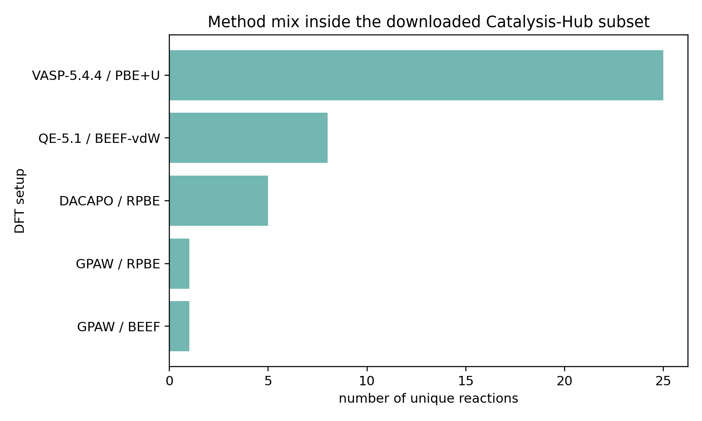
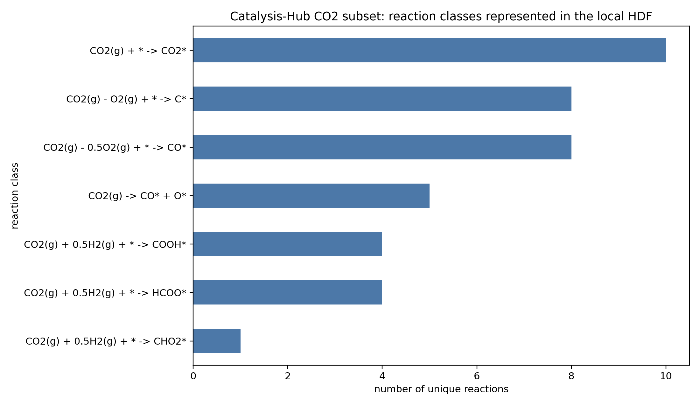
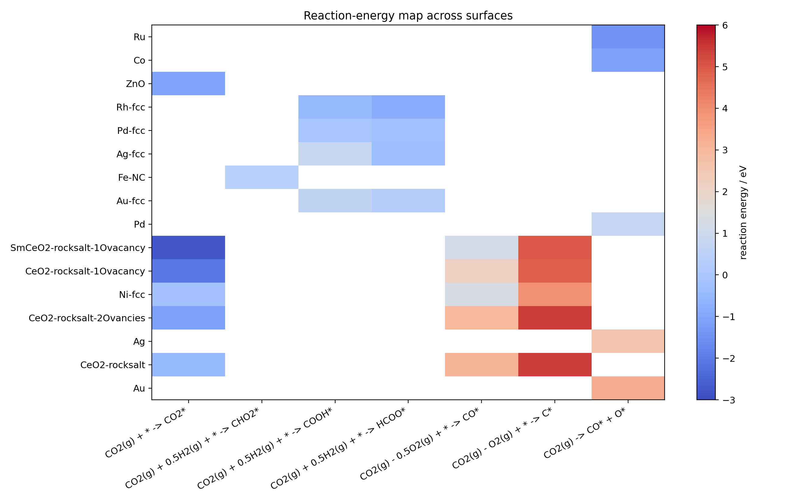
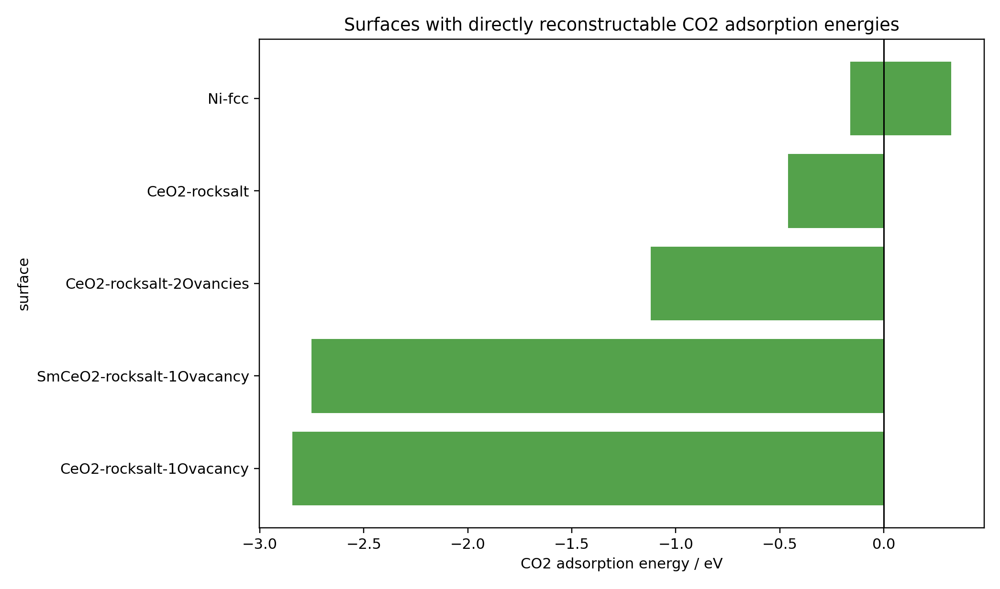
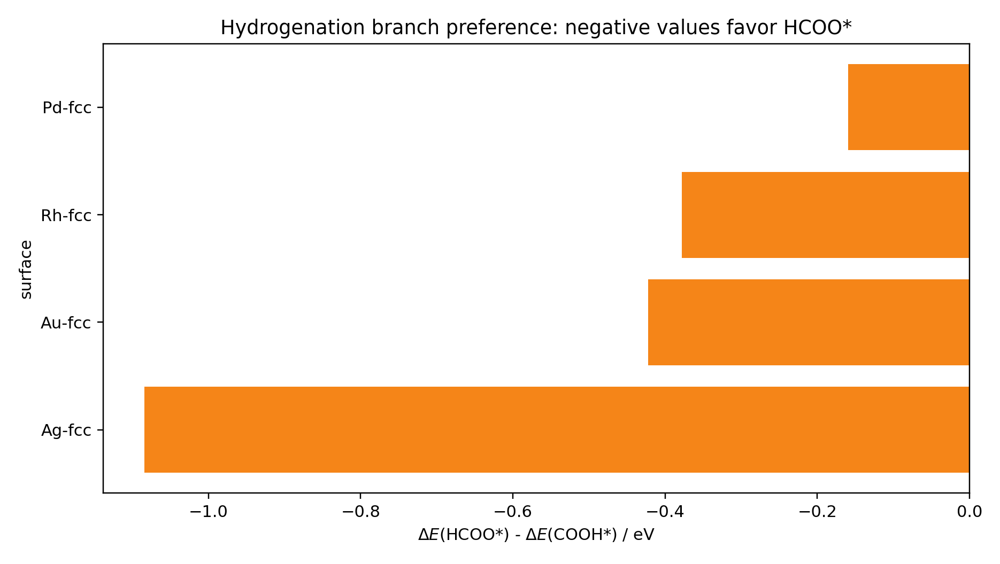
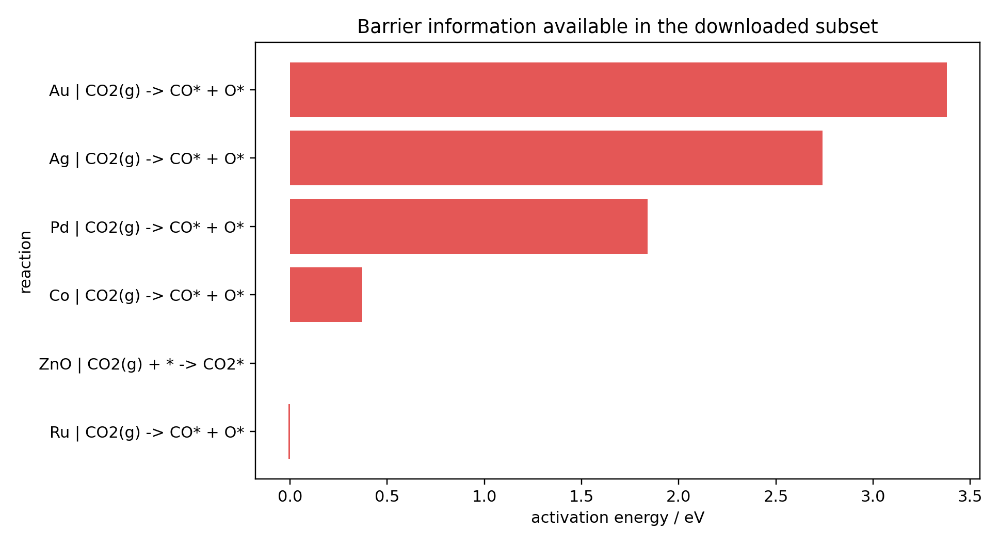

# Technical Report: Analysis of the Downloaded Catalysis-Hub CO2 Dataset

**Audience:** experimental chemists interested in the interpreted trends rather than the theoretical implementation details.

**Source file analyzed:** `notebooks/catalysis_hub_tutorial/outputs/catalysis_hub_co2_subset.hdf`

## Executive Summary

This report analyzes the local Catalysis-Hub HDF subset that was previously downloaded and converted into a tabular format.
The dataset contains **133 linked system rows** corresponding to **40 unique reaction entries** across **16 surface compositions** from **6 literature sources**.

The chemical focus of the downloaded subset is **CO2 activation on surfaces**. The dominant reaction classes are:

- molecular CO2 adsorption, `CO2(g) + * -> CO2*`
- dissociation toward `CO* + O*`
- deep deoxygenation toward `C*`
- first hydrogenation toward `HCOO*`, `COOH*`, and `CHO2*`

The main data-driven conclusions are:

1. **Vacancy-rich ceria-derived oxide surfaces bind CO2 most strongly.**
   The most stabilizing adsorption energies in the dataset are found for `CeO2-rocksalt-1Ovacancy`, `SmCeO2-rocksalt-1Ovacancy`, and `CeO2-rocksalt-2Ovancies`, with reconstructed CO2 adsorption energies between roughly `-2.84 eV` and `-1.12 eV`.

2. **Ni binds CO2 much more weakly than reduced ceria, and facet matters.**
   In this subset the Ni entries shift from slightly exergonic adsorption on `Ni(211)` (`-0.161 eV`) to mildly endergonic adsorption on `Ni(111)` (`+0.325 eV`).

3. **Direct C formation from CO2 is strongly uphill on all surfaces where it appears.**
   The `CO2 -> C*` entries are among the most endergonic reactions in the entire dataset, typically between `+3.95 eV` and `+5.78 eV`. This strongly argues against deep direct deoxygenation as a realistic low-energy route under the conditions represented here.

4. **For the small metal subset with hydrogenation data, HCOO* is consistently more stable than COOH*.**
   On Ag, Au, Pd, and Rh the energy difference `E(HCOO*) - E(COOH*)` is always negative, meaning the formate-like branch is favored over the carboxyl branch in this dataset.

5. **Barrier information is sparse but chemically informative.**
   Only six unique reactions in the subset contain a finite activation barrier. Among them, Ru and Co are the only surfaces where the direct `CO2 -> CO* + O*` dissociation step is both thermodynamically favorable and associated with a comparatively small barrier.

## 1. What is in the downloaded file?

The local HDF is not a single homogeneous study. It is a stitched subset of Catalysis-Hub entries from several publications, different DFT engines, and different methodological settings.
That is useful for trend spotting, but it means the dataset should be treated as a **comparative screening dataset**, not as a single internally uniform benchmark.

| metric | value |
| --- | --- |
| system rows in HDF | 133 |
| unique reactions | 40 |
| surface compositions | 16 |
| publications represented | 6 |
| rows marked review by curation | 8 |
| directly reconstructable CO2 adsorption energies | 9 |
| finite activation barriers | 6 |

### Publications and methods represented

The downloaded subset spans classic metal-surface CO2 dissociation studies, oxide-vacancy chemistry, and small electrochemical CO2-reduction descriptor datasets.
The method mix is dominated by `VASP / PBE+U` for the ceria-based oxide entries, `DACAPO / RPBE` for several older metal dissociation entries, and `QE / BEEF-vdW` for the hydrogenation branch entries on close-packed metals.

## 2. Curation and data quality

A light curation pass was applied before interpretation.
Rows were marked for review when they lacked an energy, had no reliable structure, or exceeded conservative force thresholds.
In practice, the review rows are almost entirely the six `N/A` entries that only carry a reaction summary without a linked system energy, plus two rows with somewhat elevated residual forces.

This matters because the reaction-level trends remain usable, but **system-level adsorption-energy reconstruction is only meaningful when the corresponding gas, surface, and adsorbate rows are all present under the same reaction id**.

## 3. Reaction classes represented in the subset

The figure below shows that the file is heavily centered on CO2 adsorption and first-step transformations rather than on long, fully resolved pathways.

This is exactly what an experimental reader should keep in mind: this dataset is strong for **first mechanistic ranking questions** such as
“which surfaces bind CO2 strongly?”, “which direction of the first hydrogenation step is preferred?”, and “is direct dissociation plausible?”.
It is not a complete mechanistic map all the way to a final product.

## 4. Reaction-energy landscape across surfaces

The heatmap below condenses the core result of the dataset.
Blue entries are stabilizing or exergonic, red entries are uphill.

Three broad patterns emerge:

- **Oxide and defective oxide surfaces** stabilize molecular CO2 adsorption much more strongly than the small metal subset.
- **Direct CO formation** from CO2 is uphill on the oxide entries shown here, but can become favorable on specific stepped transition-metal surfaces such as Ru(211) and Co(211).
- **Direct carbon formation** is always strongly uphill and therefore chemically implausible as a facile elementary step in this dataset.

### Surface-family summary

| surface_family | reactions | mean_reaction_energy | min_reaction_energy | max_reaction_energy | barriers |
| --- | --- | --- | --- | --- | --- |
| metal | 19 | 0.824 | -1.477 | 4.947 | 5 |
| oxide/support | 20 | 1.632 | -2.843 | 5.778 | 1 |
| single-atom/support | 1 | 0.412 | 0.412 | 0.412 | 0 |

The table above should not be over-read quantitatively because the families are sampled unevenly, but qualitatively it is clear that:

- the **oxide/support** class contains the strongest CO2-binding entries;
- the **metal** class contains the most direct dissociation/barrier data;
- the single Fe–N–C entry is too sparse for a broad comparative statement.

## 5. Directly reconstructable CO2 adsorption energies

A valuable technical check is that the local HDF contains enough information to reconstruct adsorption energies directly for the `CO2*` entries.
For nine reactions, the corresponding `CO2gas`, `star`, and `CO2star` rows are present under the same reaction id.
Using

`E_ads(CO2) = E(CO2*) - E(*) - E(CO2_g)`

reproduces the published Catalysis-Hub `reactionEnergy` values to numerical precision.

### Experimental interpretation

For an experimental audience, the practical reading is:

- **strongly negative adsorption energies** imply surfaces that are effective at trapping and activating CO2;
- **mildly negative or near-zero adsorption energies** imply weaker molecular binding, often more compatible with facile desorption or with the need for additional activation steps;
- **positive adsorption energies** mean that molecular CO2 adsorption itself is not favored under the chosen reference.

In this subset, vacancy-rich ceria surfaces clearly dominate the strong-binding regime, whereas Ni lies much closer to thermoneutral adsorption.

### Lowest-energy CO2 adsorption entries

| surfaceComposition | facet | adsorption_energy | reactionEnergy | publication_title |
| --- | --- | --- | --- | --- |
| CeO2-rocksalt-1Ovacancy | 100 | -2.843 | -2.843 | Selective high-temperature CO2 electrolysis enabled by oxidized carbon intermediates |
| SmCeO2-rocksalt-1Ovacancy | 100 | -2.751 | -2.751 | Selective high-temperature CO2 electrolysis enabled by oxidized carbon intermediates |
| CeO2-rocksalt-1Ovacancy | 110 | -2.067 | -2.067 | Selective high-temperature CO2 electrolysis enabled by oxidized carbon intermediates |
| CeO2-rocksalt-2Ovancies | 111 | -1.122 | -1.122 | Selective high-temperature CO2 electrolysis enabled by oxidized carbon intermediates |
| CeO2-rocksalt-1Ovacancy | 111 | -1.006 | -1.006 | Selective high-temperature CO2 electrolysis enabled by oxidized carbon intermediates |
| CeO2-rocksalt-1Ovacancy | 111 | -0.828 | -0.828 | Selective high-temperature CO2 electrolysis enabled by oxidized carbon intermediates |
| CeO2-rocksalt | 111 | -0.46 | -0.46 | Selective high-temperature CO2 electrolysis enabled by oxidized carbon intermediates |
| Ni-fcc | 211 | -0.161 | -0.161 | Selective high-temperature CO2 electrolysis enabled by oxidized carbon intermediates |
| Ni-fcc | 111 | 0.325 | 0.325 | Selective high-temperature CO2 electrolysis enabled by oxidized carbon intermediates |

## 6. Competition between HCOO* and COOH* on metals

One of the most experimentally relevant questions is which branch of the first hydrogenation step is preferred.
In this subset, four metals contain both `HCOO*` and `COOH*` entries.

The interpretation is straightforward:

- negative values mean `HCOO*` is more stable than `COOH*`;
- positive values would mean the opposite.

Here, **all four metals favor HCOO***.
The preference is strongest for Ag and weakest for Pd, but the sign is consistent across the available metal entries.

For experiment, this suggests that under conditions represented by these calculations, the first hydrogenation event is more likely to populate a **formate-like intermediate** than a **carboxyl-like intermediate** on these metal surfaces.

### Hydrogenation-branch comparison table

| surfaceComposition | HCOO_minus_COOH_eV |
| --- | --- |
| Ag-fcc | -1.084 |
| Au-fcc | -0.422 |
| Rh-fcc | -0.378 |
| Pd-fcc | -0.159 |

## 7. Direct CO2 dissociation and available barriers

Barrier data are sparse in the downloaded subset, but they are highly useful because they immediately separate merely favorable final states from kinetically plausible steps.

The barrier-containing subset leads to three practical takeaways:

1. **Ru(211)** stands out as the most favorable dissociation case in the downloaded data:
   reaction energy `-1.477 eV` and a listed barrier very close to zero.

2. **Co(211)** is also favorable:
   reaction energy `-1.107 eV` with a moderate barrier of `0.372 eV`.

3. **Pd(111)`, `Ag(211)`, and `Au(111)` are much less promising for this direct dissociation step**:
   both thermodynamics and barriers are less favorable.

The ZnO entry is special because it corresponds to molecular CO2 adsorption with a reported barrier of `0.000 eV`, which is consistent with essentially barrierless adsorption in that specific study.

### Barrier table

| surfaceComposition | facet | Equation | reactionEnergy | activationEnergy | publication_title |
| --- | --- | --- | --- | --- | --- |
| Ru | 211 | CO2(g) -> CO* + O* | -1.477 | -0.009 | Trends in CO oxidation rates for metal nanoparticles and close-packed, stepped, and kinked surfaces |
| ZnO | 1 | CO2(g) + * -> CO2* | -1.04 | 0 | Thermochemistry and micro-kinetic analysis of methanol synthesis on ZnO (0001) |
| Co | 211 | CO2(g) -> CO* + O* | -1.107 | 0.372 | Trends in CO oxidation rates for metal nanoparticles and close-packed, stepped, and kinked surfaces |
| Pd | 111 | CO2(g) -> CO* + O* | 0.74 | 1.84 | Trends in the catalytic CO oxidation activity of nanoparticles |
| Ag | 211 | CO2(g) -> CO* + O* | 2.623 | 2.739 | Trends in CO oxidation rates for metal nanoparticles and close-packed, stepped, and kinked surfaces |
| Au | 111 | CO2(g) -> CO* + O* | 3.29 | 3.38 | Trends in the catalytic CO oxidation activity of nanoparticles |

## 8. Most favorable and least favorable reactions in the downloaded subset

These two tables are a useful “bottom line” for rapid experimental reading.
They show which elementary steps are strongly stabilized and which are strongly disfavored.

### Ten most exergonic entries

| surfaceComposition | facet | Equation | reactionEnergy | activationEnergy |
| --- | --- | --- | --- | --- |
| CeO2-rocksalt-1Ovacancy | 100 | CO2(g) + * -> CO2* | -2.843 |  |
| SmCeO2-rocksalt-1Ovacancy | 100 | CO2(g) + * -> CO2* | -2.751 |  |
| CeO2-rocksalt-1Ovacancy | 110 | CO2(g) + * -> CO2* | -2.067 |  |
| Ru | 211 | CO2(g) -> CO* + O* | -1.477 | -0.009 |
| CeO2-rocksalt-2Ovancies | 111 | CO2(g) + * -> CO2* | -1.122 |  |
| Co | 211 | CO2(g) -> CO* + O* | -1.107 | 0.372 |
| ZnO | 1 | CO2(g) + * -> CO2* | -1.04 | 0 |
| CeO2-rocksalt-1Ovacancy | 111 | CO2(g) + * -> CO2* | -1.006 |  |
| CeO2-rocksalt-1Ovacancy | 111 | CO2(g) + * -> CO2* | -0.828 |  |
| Rh-fcc | 211 | CO2(g) + 0.5H2(g) + * -> HCOO* | -0.823 |  |

### Ten most endergonic entries

| surfaceComposition | facet | Equation | reactionEnergy | activationEnergy |
| --- | --- | --- | --- | --- |
| CeO2-rocksalt-1Ovacancy | 111 | CO2(g) - O2(g) + * -> C* | 5.778 |  |
| CeO2-rocksalt | 111 | CO2(g) - O2(g) + * -> C* | 5.422 |  |
| CeO2-rocksalt-2Ovancies | 111 | CO2(g) - O2(g) + * -> C* | 5.395 |  |
| SmCeO2-rocksalt-1Ovacancy | 100 | CO2(g) - O2(g) + * -> C* | 4.999 |  |
| CeO2-rocksalt-1Ovacancy | 100 | CO2(g) - O2(g) + * -> C* | 4.961 |  |
| Ni-fcc | 111 | CO2(g) - O2(g) + * -> C* | 4.947 |  |
| CeO2-rocksalt-1Ovacancy | 110 | CO2(g) - O2(g) + * -> C* | 4.859 |  |
| Ni-fcc | 211 | CO2(g) - O2(g) + * -> C* | 3.953 |  |
| Au | 111 | CO2(g) -> CO* + O* | 3.29 | 3.38 |
| CeO2-rocksalt | 111 | CO2(g) - 0.5O2(g) + * -> CO* | 3.055 |  |

The most important chemical message from these extremes is that:

- **molecular CO2 adsorption** can be strongly favorable on reduced ceria-type surfaces;
- **C* formation** is consistently too uphill to be considered an accessible first-step route in this subset.

## 9. What an experimental chemist can take away

If the question is “which classes of surfaces deserve attention for CO2 activation?”, this dataset supports the following hierarchy:

- **Defective ceria-based oxides**: strongest CO2 capture and activation in the present data.
- **Stepped transition-metal surfaces such as Ru(211) and Co(211)**: most promising for direct dissociation among the barrier-containing subset.
- **Au, Ag, Pd**: weaker for direct dissociation, but still chemically informative in hydrogenation-branch comparisons.
- **Ni**: intermediate behavior, with facet-sensitive CO2 adsorption.

If the question is “which first hydrogenation branch is preferred?”, the answer from this subset is:

- the available metal entries consistently favor **HCOO*** over **COOH***.

If the question is “is direct carbon deposition from CO2 a low-energy route here?”, the answer is:

- **no**. The `CO2 -> C*` entries are far too uphill in this dataset.

## 10. Limitations of this dataset

This report should be read with a few clear limitations in mind:

1. The file is a **subset**, not the whole of Catalysis-Hub.
2. It mixes **different publications, codes, and functionals**.
3. The number of explicit **barrier entries is small**.
4. Most entries are **first-step thermodynamic snapshots**, not complete pathways.
5. Only a subset of rows can be used for exact adsorption-energy reconstruction because that requires the matching gas, clean surface, and adsorbate entries under the same reaction id.

These limitations do not erase the value of the data.
They simply define the right use case: **comparative screening and mechanistic direction-finding**, not single-number absolute benchmarking across all systems.

## 11. Final conclusion

The downloaded Catalysis-Hub HDF already contains enough chemically resolved information to support a meaningful, master-thesis-level analysis for an experimental audience.

The strongest and clearest results are:

- CO2 adsorption is most favorable on defective ceria-derived oxide surfaces.
- Ni shows much weaker, facet-sensitive CO2 adsorption.
- Ru(211) and Co(211) are the most favorable direct dissociation cases among the barrier-containing entries.
- The first hydrogenation step on the available close-packed metal surfaces favors HCOO* over COOH*.
- Direct formation of C* from CO2 is strongly disfavored in the downloaded subset.

In practical experimental language:
this dataset points much more strongly toward **surface-specific CO2 activation and selective first-step chemistry** than toward indiscriminate deep deoxygenation.
