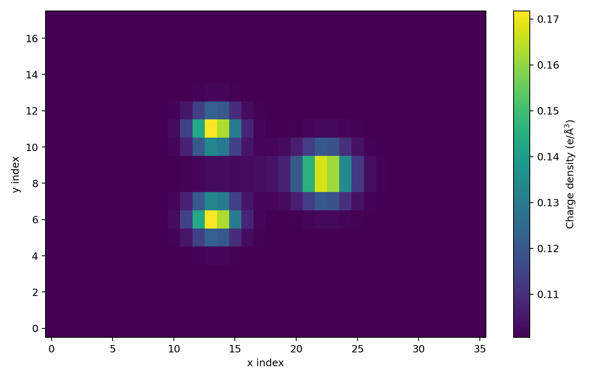
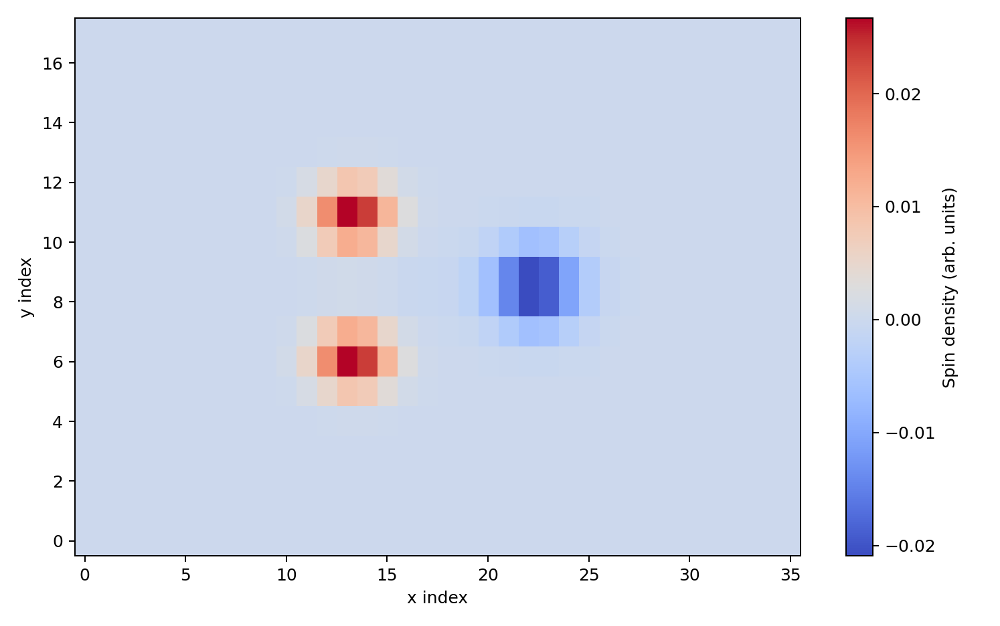
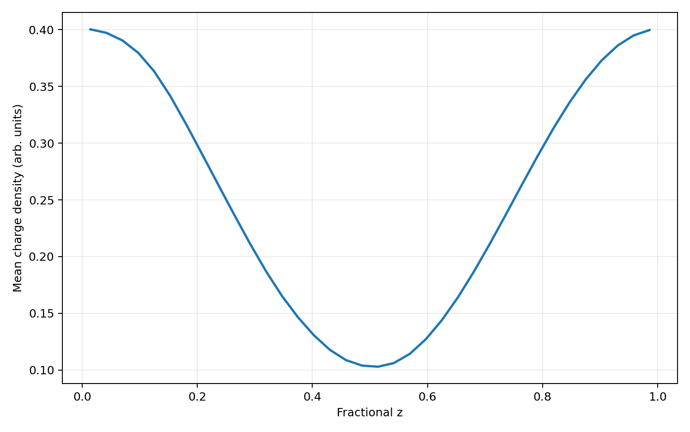
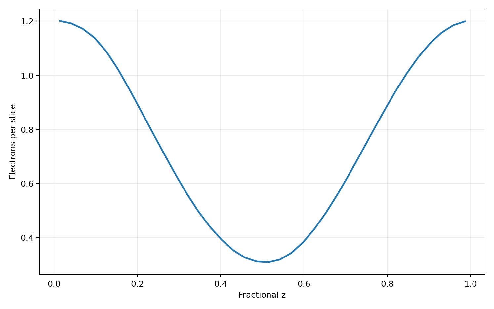
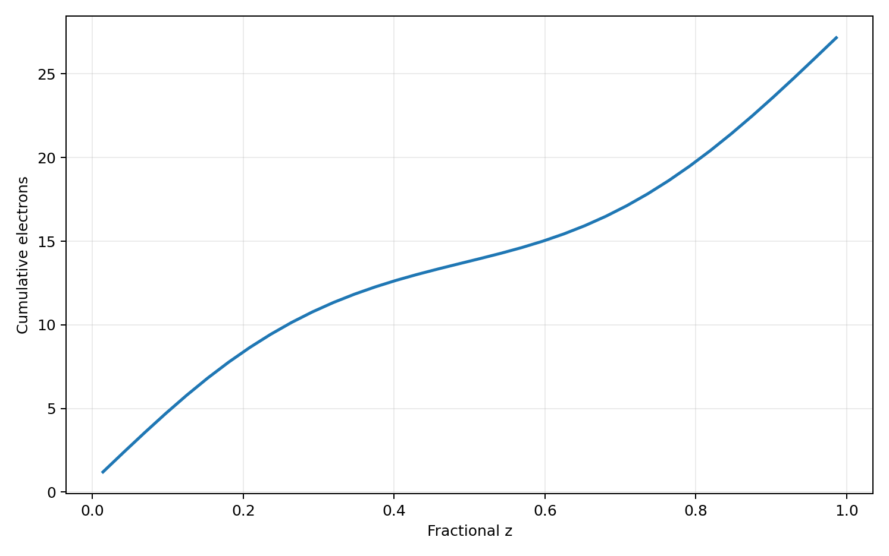
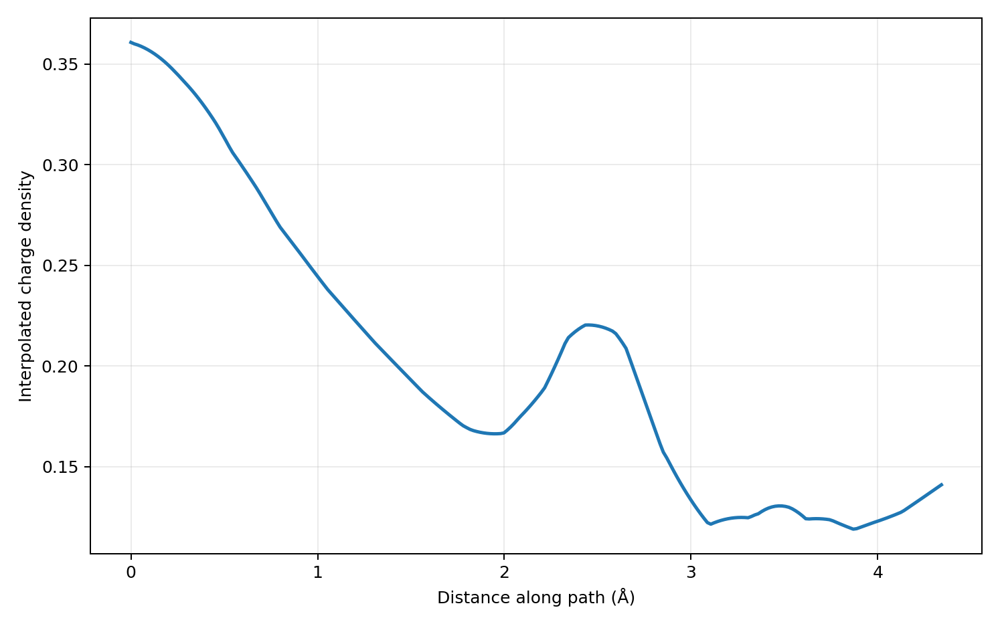
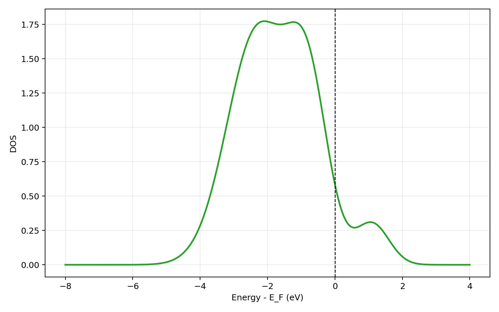
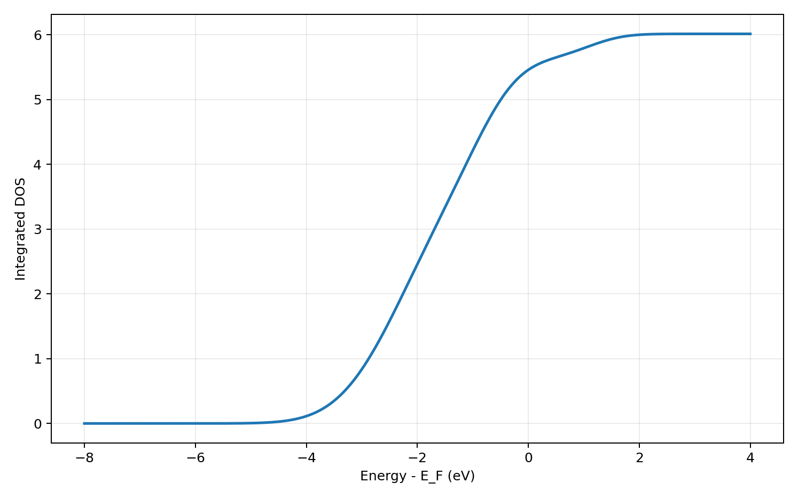
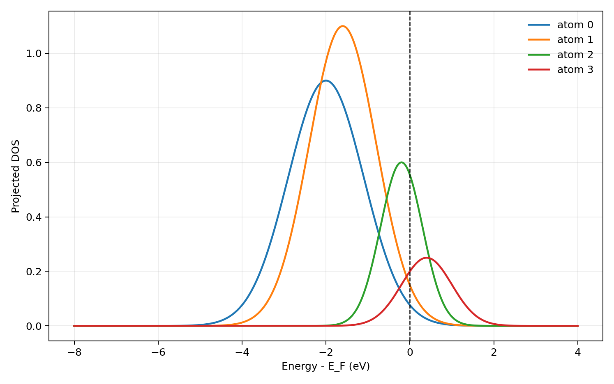
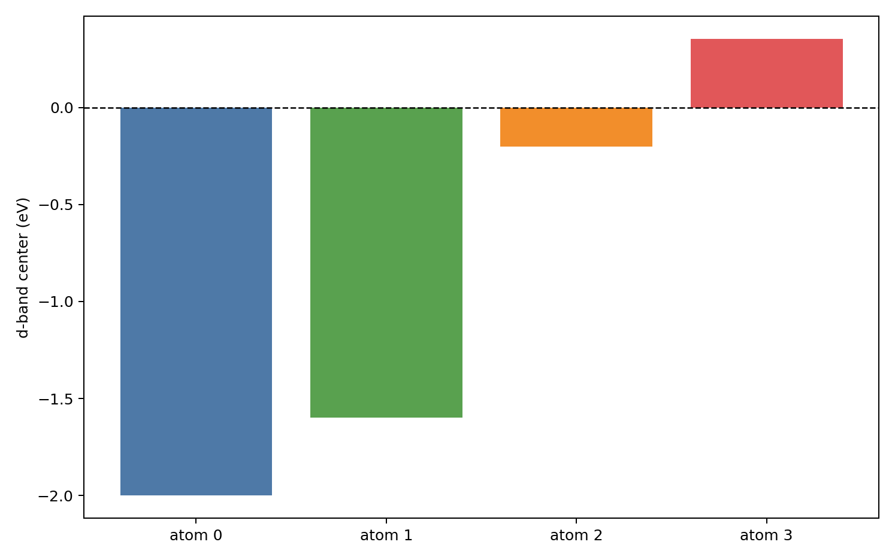

# Xarray For CHGCAR And DOSCAR In OnePiece

This homework-style note shows how `xarray` is used in OnePiece to turn VASP CHGCAR and DOSCAR data into labeled scientific datasets.

The figures below were generated from the backend xarray functions added in version `1.0.0`.

## 1. Why xarray is useful for CHGCAR

The CHGCAR reader already gives us a 3D numerical field, but xarray adds labels for each axis. That means the charge density is no longer just an anonymous ndarray. It becomes a data object with named dimensions x, y, and z, coordinate values at voxel centers, and metadata for the cell and atomic positions.

*Figure:* Charge density slice from CHGCAR as a labeled xarray field

## 2. Multiple variables in one dataset

The same CHGCAR-derived dataset can hold both charge density and spin density. This is an important difference from a plain DataFrame because both variables share the same 3D coordinates and can be sliced consistently.

*Figure:* Spin-density slice from the same grid using an additional data variable

## 3. Planar averages

A common surface-science task is to collapse a 3D field along the slab normal. With xarray, we can average over named dimensions and keep the remaining coordinate automatically.

*Figure:* Planar average along z computed by averaging over x and y

## 4. Charge per slice

A second useful reduction is the electron content of each z slice. This is obtained from the density sum multiplied by voxel volume and is a better physical quantity than a raw array sum.

*Figure:* Electrons per z-slice from density summation times voxel volume

## 5. Cumulative electron profile

The cumulative profile is useful when we want to ask where electrons accumulate relative to the metal surface and adsorbate region.

*Figure:* Cumulative electron profile that tracks where charge accumulates through the slab normal

## 6. Interpolated line profile

Not every scientifically meaningful path is parallel to a grid axis. xarray interpolation lets us sample a path through the 3D field while keeping the coordinate bookkeeping explicit.

*Figure:* Line interpolation through the 3D CHGCAR grid in fractional coordinates

## 7. DOSCAR as a labeled energy dataset

DOSCAR data are naturally organized along an energy axis. Representing total DOS with xarray makes energy-window operations and Fermi-level alignment easier to reason about.

*Figure:* Total DOS with an energy coordinate referenced to the Fermi level

## 8. Integrated DOS

Because the energy coordinate is explicit, the integrated total DOS is easy to plot and compare with selected energy windows.

*Figure:* Integrated total DOS as an energy-ordered cumulative observable

## 9. Atom- and orbital-resolved PDOS

Projected DOS is where xarray becomes especially useful. The data carry atom, orbital, and energy labels simultaneously, so selection stays readable and less error-prone.

*Figure:* Atom-resolved d-projected DOS extracted from the orbital dimension

## 10. d-band centers from selected subspaces

OnePiece can now calculate orbital band centers from xarray-selected PDOS subspaces. This is a practical bridge from raw DOSCAR data to catalysis descriptors that experimental collaborators may want to correlate with trends.

*Figure:* d-band centers from xarray-selected atom and orbital subspaces
