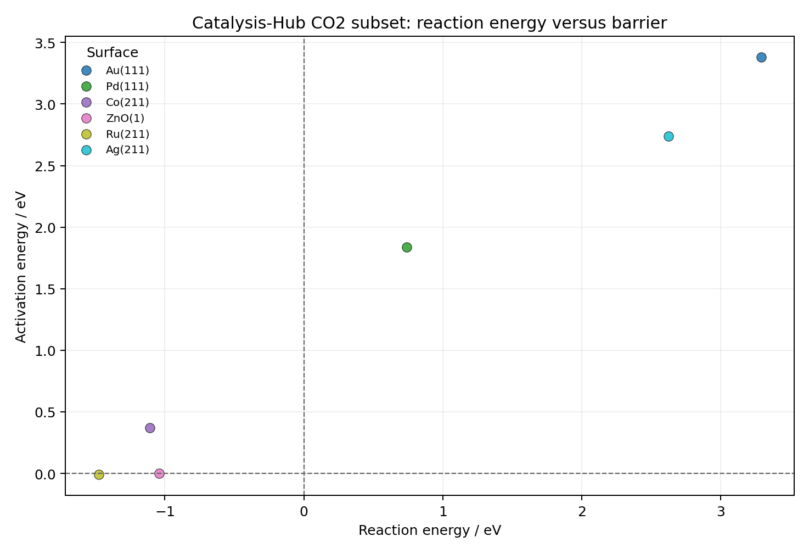
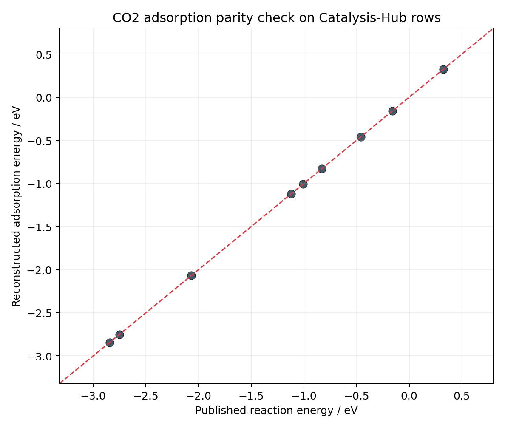
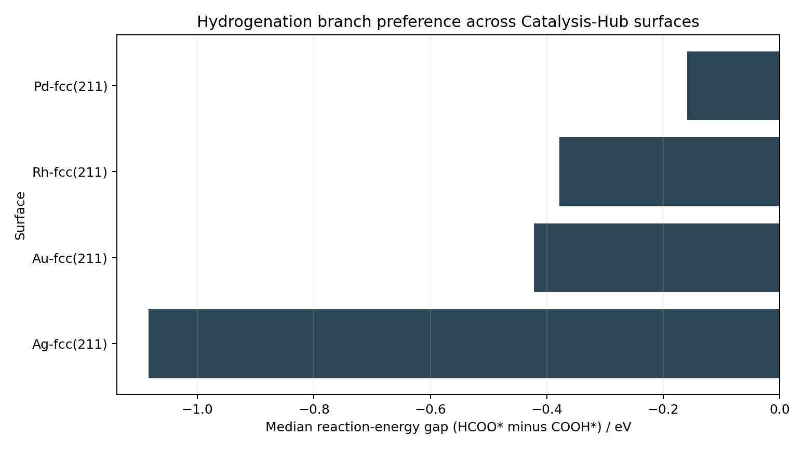

# Catalysis-Hub Worked Example

This page is a worked example built from the **bundled Catalysis-Hub CO2
subset** that ships with `onepiece-studio`.

It is meant to show how the package can turn a reaction-style surface dataset
into a reproducible local analysis workflow, even when the source data are not a
full VASP directory tree with `CHGCAR` and `DOSCAR` files.

## What This Example Uses

Data source:

- bundled package dataset:
  `src/onepiece/data/catalysis_hub_co2_subset.hdf`

Backend operation used:

- `onepiece.add_catalysis_hub_adsorption_energies(...)`

Generated analysis assets:

- reaction-energy versus barrier scatter
- CO2 adsorption parity check
- CO2 adsorption heatmap by surface and facet
- hydrogenation branch comparison for `HCOO*` versus `COOH*`

## Why This Example Matters

This dataset is small, but it is useful because it makes three things very
concrete:

1. reaction-centric surface data can still be normalized into adsorption-style
   quantities
2. the UI plotting logic can be used meaningfully even before a richer local
   VASP dataset is available
3. the package remains honest about data limits

The bundled Catalysis-Hub subset does **not** include local `CHGCAR` or
`DOSCAR` files, so this example focuses on:

- reaction energies
- activation barriers
- reconstructed adsorption energies
- branching comparisons

It therefore complements, rather than replaces, the richer ASE/VASP workflows
described elsewhere in the docs.

## How The Example Was Generated

The underlying script is:

- `notebooks/catalysis_hub_tutorial/build_catalysis_hub_worked_example.py`

It reads the bundled dataset, enriches it with reconstructed adsorption
energies, and writes figures plus summary tables.

## 1. Reaction Energy Versus Barrier

This is the broadest kinetic overview in the bundled dataset.



What to look for:

- points in the **lower-left** region are both exergonic and low-barrier
- points with low barrier but strongly uphill energetics may be kinetically
  reachable but thermodynamically unfavorable
- points with favorable reaction energy but high barrier can still be poor
  practical candidates

For an experimentalist, this plot is the quickest way to separate:

- surfaces that look broadly promising
- surfaces that are only interesting from one of the two perspectives

## 2. CO2 Adsorption Parity Check

The package reconstructs Catalysis-Hub-style adsorption energies from the
triplet:

- gas-phase row
- clean `star` row
- adsorbate `CO2star` row

and compares that value against the published `reactionEnergy`.



Interpretation:

- points close to the diagonal show that the local reconstruction is consistent
  with the published quantity
- this is primarily a **data integrity and semantic consistency** check
- it matters because later dataset workflows depend on these same bookkeeping
  assumptions

In other words, this plot helps establish that the OnePiece interpretation of
the Catalysis-Hub rows is not drifting away from the published data model.

## 3. CO2 Adsorption Heatmap By Surface And Facet

This view focuses on the direct adsorption step:

- `CO2(g) + * -> CO2*`

using median reconstructed adsorption energy by surface and facet.


This is a good screening view when you want to ask:

- which metals appear to bind CO2 more strongly?
- does the facet shift the adsorption trend materially?
- are there families where adsorption is consistently weak or strong?

Even with a small dataset, the heatmap is often easier to read than a long
table because it exposes:

- missing combinations
- facet dependence
- chemically similar rows that cluster together

## 4. Hydrogenation Branch Preference

The bundled subset also includes early hydrogenation routes:

- `CO2(g) + 0.5H2(g) + * -> HCOO*`
- `CO2(g) + 0.5H2(g) + * -> COOH*`

The following plot compares the **median reaction-energy gap**:

```text
HCOO* route minus COOH* route
```



Interpretation:

- **negative** values mean the `HCOO*` route is more favorable
- **positive** values mean the `COOH*` route is more favorable

This is particularly useful for experimental chemists because it begins to
translate DFT rows into a mechanistic branch question:

- is the surface more formate-like?
- or more carboxyl-like?

That is often a more chemically meaningful framing than staring at isolated row
energies.

## What This Example Does Not Yet Show

Because the bundled Catalysis-Hub subset is not a local VASP folder dataset, it
does **not** demonstrate:

- `CHGCAR`-based charge transfer
- `DOSCAR`-based d-band descriptors
- ASE-derived adsorption-site classification from real slab geometries

Those workflows are documented separately in:

- [VASP Charge And DOS Workflows](vasp_charge_and_dos.md)
- [Recommended Analysis Views](recommended_analysis_views.md)

## How To Reproduce The Example

Run:

```bash
python notebooks/catalysis_hub_tutorial/build_catalysis_hub_worked_example.py
```

The script writes:

- figures into `docs/source/_static/worked_examples/catalysis_hub/`
- summary tables into `notebooks/catalysis_hub_tutorial/outputs/`

## Practical Takeaway

This small worked example is useful because it shows the package can already do
meaningful chemistry on a compact, publication-derived reaction dataset:

- normalize rows into adsorption-style energetics
- compare kinetics and thermodynamics
- compare mechanistic branches
- and present all of that in a local, reproducible workflow

Then, once a richer local dataset with `CHGCAR`, `DOSCAR`, and more faithful ASE
structures is available, the same workbench can naturally extend into the
charge-transfer and electronic-structure layers.
