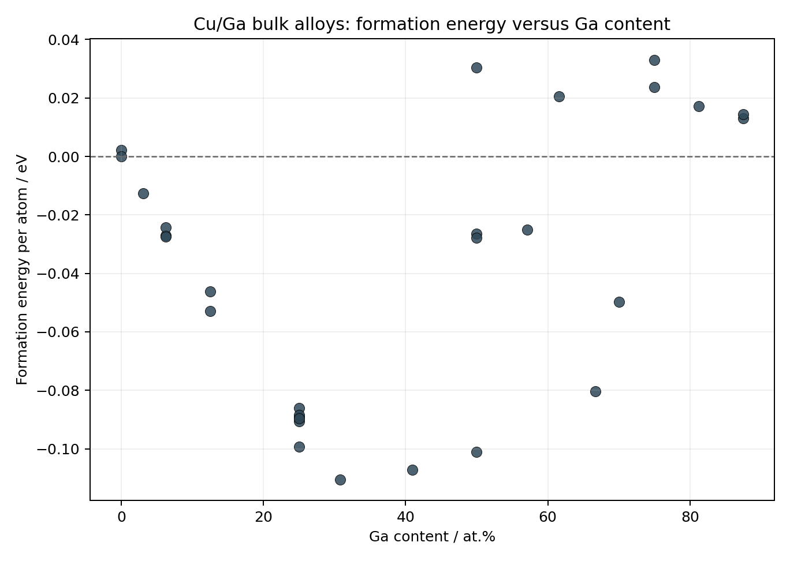
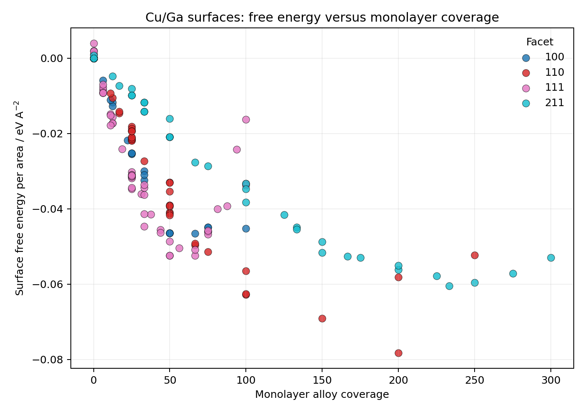
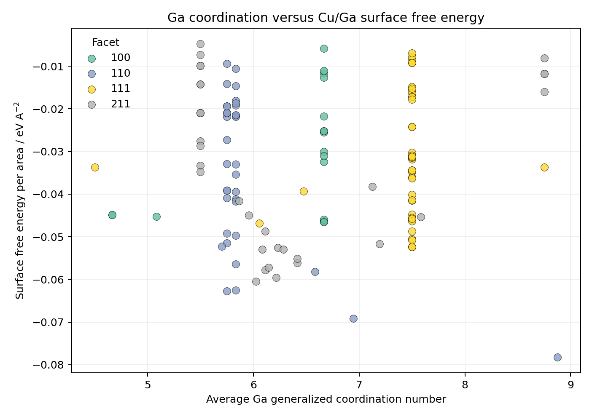
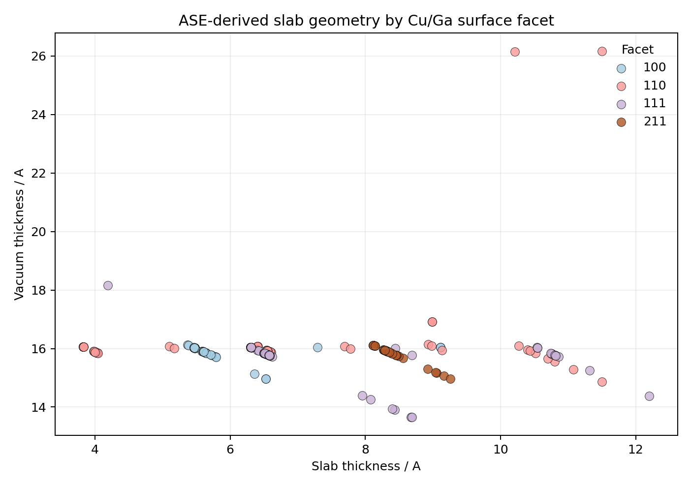

# Cu/Ga Worked Example

This page is the complementary worked example to the Catalysis-Hub reaction
subset.

Here the goal is different: instead of a compact reaction database, we use a
**local Cu/Ga structure dataset** with ASE `Atoms` objects in every row and
materials-specific columns for:

- bulk alloy formation energies
- surface free energies
- Ga/Cu composition
- generalized coordination numbers
- local charge descriptors
- slab geometry

The source file used here is:

- `notebooks/phase_diagram_outputs/cuga_full_dataset.pkl`

The underlying analysis script is:

- `notebooks/build_cuga_worked_example.py`

## Why This Example Matters

This dataset is closer to the day-to-day style of local computational materials
work:

- one dataframe contains bulk-like and surface-like rows
- every row already has an ASE structure
- many scientifically useful descriptors are already stored or can be derived
- the analysis is not only about one reaction, but about a whole materials
  landscape

It therefore shows the more **workbench-like** side of `onepiece-studio`.

## What The Script Does

The script:

1. loads the Cu/Ga dataframe
2. runs `add_ase_analysis_descriptors(...)`
3. splits the data into bulk-like and surface-like subsets
4. generates a small family of figures for:
   - thermodynamic stability
   - coordination trends
   - charge/coordinaton correlation
   - ASE-derived slab geometry
5. writes summary tables back into the repo

## 1. Bulk Formation Energy Versus Ga Content

This is the first natural bulk-screening view.



What to look for:

- points below zero are energetically favorable against the chosen references
- composition alone does not determine stability
- several Ga fractions host locally favorable bulk candidates

For an experimental chemist, this is the plot that answers:

- where in composition space does the alloy family begin to look promising?

## 2. Surface Free Energy Versus Monolayer Coverage

This is the natural surface-screening view for the alloyed slabs.



Why it matters:

- it separates facet effects from alloy-coverage effects
- it shows whether the same coverage range behaves differently on `100`, `110`,
  `111`, and `211`
- it is much closer to a surface-science question than a generic scatter plot

This is the right first figure when you want to compare:

- how much alloying the surface tolerates
- whether a facet is intrinsically more or less stable in the same coverage
  regime

## 3. Ga Coordination Versus Surface Free Energy

This view connects a structural descriptor to thermodynamic stability.



Why this is useful:

- generalized coordination is often a better structural handle than raw
  composition alone
- if low-coordinated Ga systematically coincides with low stability, that tells
  a strong physical story
- if a specific facet deviates from the broader trend, it is immediately visible

This is the kind of plot that helps move from:

- "which rows are low in energy?"

to:

- "what structural motif tends to stabilize or destabilize the surface?"

## 4. Ga Charge Versus Coordination

The dataset already contains charge-like descriptors for Ga and Cu atoms.


This is a good bridge between local chemistry and local structure:

- coordination describes the geometric environment
- charge reflects local electronic redistribution

The point is not to claim absolute charges with excessive confidence. The point
is to ask:

- do under-coordinated Ga environments also look electronically distinct?
- are bulk-like and surface-like environments clearly separated?

That is often much more useful for interpretation than reading isolated charge
columns one row at a time.

## 5. ASE-Derived Slab Geometry By Facet

The new ASE analysis layer also derives structural geometry directly from the
stored `Atoms` objects.



This view helps with:

- checking whether slab construction is consistent
- spotting oddly thin slabs or unusual vacuum setup
- comparing geometric setup across facets before over-interpreting energetic
  differences

This is a quiet but important part of scientific quality control. Many bad
comparisons begin with geometries that were never really on the same footing.

## What This Example Shows About The Package

Together, these figures show that `onepiece-studio` is not only for adsorption
energies or reaction pathways.

It also works well as a local materials-analysis layer for:

- bulk alloy screening
- surface stability comparison
- coordination/charge trend analysis
- structure-derived slab QC

That is especially important for Cu/Ga-style datasets, where the scientific
story usually mixes:

- composition
- local environment
- surface thermodynamics
- and geometric reasonableness

## Generated Tables

The script also writes summary tables:

- `notebooks/phase_diagram_outputs/worked_example_tables/cuga_bulk_lowest_formation_energies.csv`
- `notebooks/phase_diagram_outputs/worked_example_tables/cuga_surface_best_candidates.csv`
- `notebooks/phase_diagram_outputs/worked_example_tables/cuga_geometry_summary.csv`

These are useful when you want the same information in a manuscript-friendly or
meeting-friendly tabular form.

## How To Reproduce It

Run:

```bash
python notebooks/build_cuga_worked_example.py
```

It will regenerate:

- figures in `docs/source/_static/worked_examples/cuga/`
- summary tables in `notebooks/phase_diagram_outputs/worked_example_tables/`

## Practical Takeaway

This Cu/Ga example shows the other half of the package identity:

- Catalysis-Hub demonstrates reaction-database logic
- Cu/Ga demonstrates local ASE/materials-workbench logic

Together they make the software feel much more complete:

- reaction energetics
- surface and bulk screening
- local structure descriptors
- charge/coordinaton trends
- geometry-aware quality control
